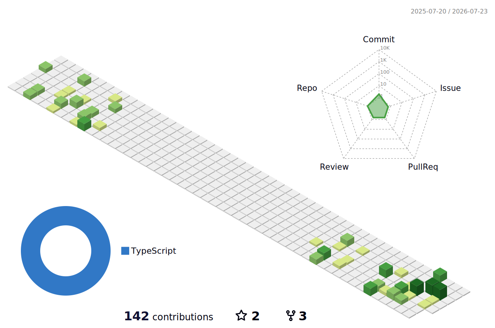

<!-- ============================================================
     Sakkar Chowdhury · profile README  (loaded edition)
     Identity: riso-print + sketchbook · coral #FF5D73 / blue #5468FF / ink #0E0E16
     Hero art: ./assets/hero.svg   (custom animated SVG)
============================================================ -->

<p align="center">
  
</p>

<!-- animated typing line -->
<p align="center">
  <a href="https://skrchowdhury.netlify.app/">
    
  </a>
</p>

<!-- socials + live view counter -->
<p align="center">
  <a href="https://skrchowdhury.netlify.app/"></a>&nbsp;
  <a href="https://linkedin.com/in/skrchowdhury"></a>&nbsp;
  <a href="https://instagram.com/skrchowdhury"></a>&nbsp;
  <a href="https://www.youtube.com/c/sakkhorchowdhury"></a>&nbsp;
  &nbsp;
  <a href="https://github.com/skrchowdhury?tab=followers"></a>
</p>

<br/>

### <samp>// whoami</samp>

```ts
const sakkar = {
  role:     "Mobile App & Web Developer",
  based:    "Dhaka, Bangladesh 🇧🇩",
  building: ["📱 mobile apps", "🖥️ web apps"],
  learning: ["React Native", "Next.js", "Node (Express / Nest)"],
  goal:     "go deeper across front-end & back-end",
  offline:  ["sings 🎤", "draws 🎨", "reads 📚"],
};
```

<br/>

### <samp>// stack</samp>

<samp>**languages**</samp>&nbsp;


<samp>**frontend**</samp>&nbsp;


<samp>**mobile**</samp>&nbsp;&nbsp;&nbsp;


<samp>**backend**</samp>&nbsp;&nbsp;


<samp>**data**</samp>&nbsp;&nbsp;&nbsp;&nbsp;&nbsp;


<samp>**tools**</samp>&nbsp;&nbsp;&nbsp;


<br/>

### <samp>// contribution snake</samp>
<!-- generated by .github/workflows/snake.yml -> output branch -->
<p align="center">
  
</p>

<br/>

### <samp>// stats</samp>

<p align="center">
  
  
</p>
<p align="center">
  
</p>

<br/>

### <samp>// activity graph</samp>
<p align="center">
  
</p>

<br/>

### <samp>// 3d contributions</samp>
<!-- generated by .github/workflows/3d-contrib.yml -> ./profile-3d-contrib -->
<p align="center">
  
</p>

<br/>

### <samp>// summary cards</samp>
<p align="center">
  
</p>
<p align="center">
  
  
</p>
<p align="center">
  
  
</p>

<br/>

### <samp>// trophies</samp>
<p align="center">
  
</p>

<br/>

### <samp>// dev quote</samp>
<p align="center">
  
</p>

<br/>

<!-- ============ FEATURED PROJECTS (fill in repo names) ============
<p align="center">
  <a href="https://github.com/skrchowdhury/REPO_ONE">
    
  </a>
  <a href="https://github.com/skrchowdhury/REPO_TWO">
    
  </a>
</p>
============================================================ -->

<p align="center">
  <samp>drawn &amp; coded by Sakkar</samp> · <a href="https://skrchowdhury.netlify.app/"><samp>skrchowdhury.netlify.app</samp></a>
</p>
<p align="center">
  
  
</p>
